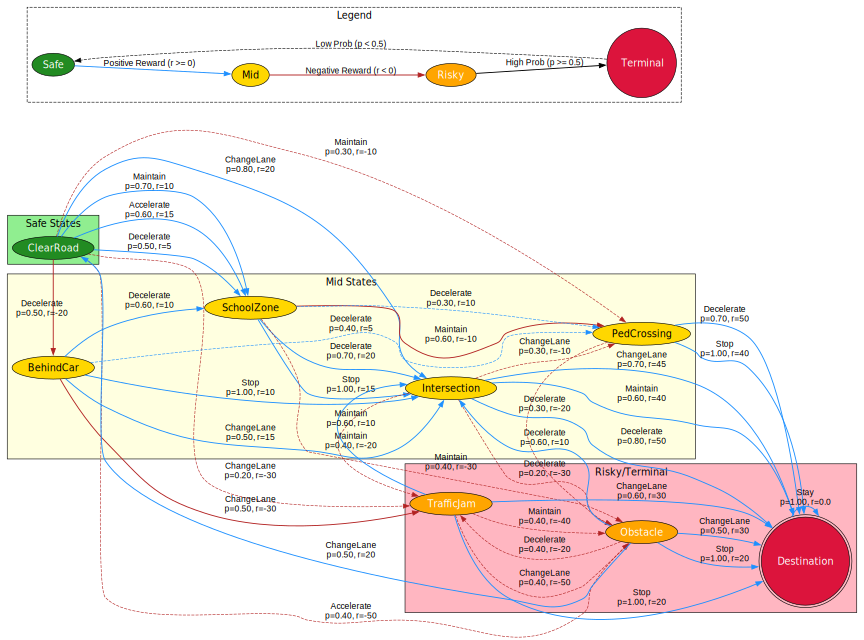
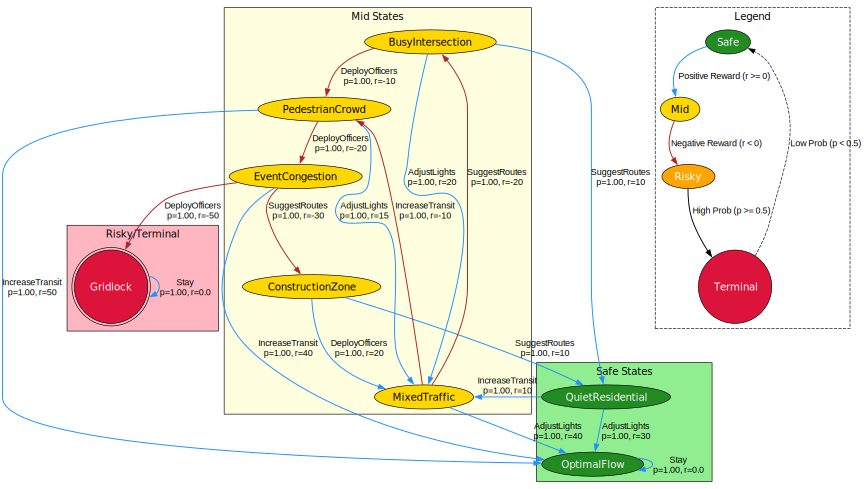

# Reinforcement Learning for Urban Mobility

In this repo, I will demonstrate a robust application of Markov Decision Processes (**MDPs**) and Dynamic Programming (**DP**) to real-world decision-making challenges, yielding optimal policies and value functions that balance safety, efficiency, and uncertainty in autonomous vehicle navigation and urban traffic management. Specifically, I will present my exploration of formulating 2 following urban mobility case studies as **Finite-horizon MDPs** and solving them using **DP** techniques:

<details>
    <summary><b>Scenario 1: Safe Navigation of an Autonomous Vehicle</b></summary>

    With the rise of self-driving cars, ensuring that they navigate safely, especially in busy areas, has become essential. These vehicles make decisions at set moments, like every few seconds or over short distances. At each of these moments, the vehicle's system decides how to drive based on what's happening around it.

    Imagine a self-driving car on a clear road. It smoothly drives forward, not having to look after any other vehicles, obstacles, or people. But sometimes, it might find itself behind another car or see someone trying to cross the road. The time of day affects the drive too. During rush hour, many vehicles and pedestrians might be around, while late at night, the roads might be almost empty.

    The vehicle's system always scans its surroundings. It can detect if the road ahead is clear, if there's a car in front, or if it's approaching a school zone where kids might be crossing. The vehicle can also see things like traffic lights, lane closures, or unexpected obstacles.
    Given what the vehicle detects, it has several options. It can keep going at its current speed, speed up, slow down, change lanes, stop completely, or steer around something without changing lanes.

    The outcome of the vehicle's decisions depends on many factors. For instance, after entering a school zone, it might need to slow down because kids are around. If the vehicle is behind a slow-moving car, it might decide to change lanes and overtake.

    The choices made by the vehicle's system can lead to safe drives or potential issues. Slowing down or stopping when someone is crossing the road is a must. Speeding up in a school zone isn't safe. Changing lanes when the next lane is clear is okay, but doing so without checking might cause accidents. Driving at a steady speed on a clear road is ideal, but if something suddenly appears, the vehicle needs to act quickly.

    To consider this a case study for an MDP, some ground rules are set. Firstly, the vehicle's system always knows the current road situation, as if it has a clear view of everything. We're not considering unexpected issues, like system glitches or sensor problems. By using past drives as reference, the vehicle can predict what might come next and the results of its choices. This helps it drive safely and efficiently, ensuring passengers reach their destinations without issues.

</details>

This scenario involves decision-making for safe and efficient road travel through urban environments with potential obstacles and varying road conditions. The description for this scenario mentioned that "_it has a clear view of everything_", which means agents always know the true state (no hidden information, unlike POMDPs). Moreover, since it also mentions that "_choices made by the vehicle's system can lead to safe drives or potential issues_", I will incorporate stochastic transitions here for probabilistic outcomes (e.g., accelerating might hit an obstacle with 0.4 probability), teaching expectation maximization

<details>
    <summary><b>Scenario 2: Urban Traffic Management for a Smart City</b></summary>

    In busy cities, managing roads, cars, and walkers is a big challenge. Think of a city where roads are always full, with main streets full of cars, quiet homes, shopping areas with lots of people, and school areas with kids coming and going. With added events, roadwork, and sudden issues like accidents, managing traffic becomes even harder.

    This is where the city's AI traffic system comes in, making decisions regularly, like a manager looking over a team, making sure everything runs smoothly.
    Sometimes, certain parts of the city have a lot of cars, making them busy areas. On the other hand, some areas might be quiet with fewer cars. Then there are places with many walkers, like near schools during drop-off times or shopping spots during sales. Special events like parades can also bring in crowds, and construction or emergencies can change the normal flow of traffic.

    Given this, the system has a set of actions to help control traffic. It can change traffic lights, giving more or less time for cars or walkers. In emergencies, it might suggest different routes for drivers or even change the direction of a street temporarily. Buses or trains might come more often during busy times, and traffic officers could help control busy spots. Sometimes, the solution might be to encourage carpooling or teach people about traffic rules and busy times.

    The system's choices can help traffic move better or cause problems. For example, handling a lot of cars by suggesting other routes or changing traffic lights can help. Also, managing crowds during an event without causing traffic jams is good. But a bad decision, like not giving walkers enough time to cross in a school area, can cause delays or safety issues.

    For this traffic management system to be considered as an MDP, some ground rules are set. The system always knows what's happening on the city's roads, seeing where cars and walkers are at any time. And while it may use past data to guess what might happen next, it knows that each choice will have a clear result, without any uncertainties.

    Using all the traffic data from the city, the system can guess the results of its choices. This info, along with the MDP methods, helps it make the best decisions. The goal is a city where traffic moves well, people walk safely, and everything stays organized and clear.

</details>

This scenario centers on optimizing traffic flow amid congestion, pedestrians, events, and safety in dynamic urban environments. The description for this scenario mentioned that "_it knows that each choice will have a clear result, without any uncertainties_". Therefore, I employed deterministic transitions here to align with that emphasis for predictable outcomes from action

## Solution Overview

I will focus on modelling these scenarios as **Finite-horizon MDPs** to reflect episodic tasks, where decisions are bounded by a time horizon `H=100` with clear termination, such as completing a commute or resolving rush-hour congestion. Both scenarios will be solved using **Value Iteration (VI)** and **Policy Iteration (PI)** algorithms, which are core DP methods for computing optimal policies:

-   **Value Iteration** iteratively updates the value function $v_h(s)$ backward from the terminal step using the Bellman optimality equation backward over `h=1` to `H`: $v_h(s)=\max_a{\sum_{s^\prime}{P(s^\prime| s,a)[R(s,a,s^\prime)+\gamma v_{h-1}(s^\prime)]}}$, where `γ=1.0` for undiscounted **Finite horizons**, converging to the optimal V\* exactly after `H` steps.
-   **Policy Iteration**, initialized stochastically, alternates policy evaluation (using expectation equation to compute $v_\pi(s)=\sum_{a}{\pi(a| s)\sum_{s^\prime}{P(s^\prime| s,a)[r+\gamma v_\pi(s^\prime)]}}$ for a policy π) and improvement (greedily updating $\pi(s)=\arg{\max_a{\sum_{s^\prime}{P(s^\prime| s,a)[r(s,a,s^\prime)+\gamma v_\pi(s^\prime)]}}}$) until policy stability or reaching the end of defined horizons for broad exploration. This algorithm often converges faster in fewer iterations despite more computation/step.

I will begin by detailing **MDP formulations** for each scenario, including the definition of at least **8** states, actions, transition probabilities, and rewards, along with rationales for my choices. Subsequently, I will compare both **VI** and **PI** algorithms applied to solve these **MDPs** on metrics like convergence time, optimal policies, value functions, and average rewards over **1000** simulated episodes.

For deeper insights, alongside **Finite-horizon** settings, I also explore **Infinite-horizon** variants (with discounted `γ=0.9`), using convergence threshold `θ=0.001`. This dual approach allows for insights into convergence behaviours like how many steps would be needed without a fixed horizon, highlighting trade-offs between exact backward computation in **Finite horizons** and iterative approximation in **Infinite** ones. These results are also then discussed to evaluate the algorithms' strengths and limitations in these contexts.

## MDP Formulation and Results

In my implementation, each **MDP** is designed to capture **episodic** nature of the problem, with a horizon `H=100` to allow sufficient steps for convergence while bounding the task. **States** are chosen here to represent key situational conditions (e.g., traffic levels or road obstacles), **actions** are state-dependent to capture context-specific feasibility (e.g., adjust speeds/signals), **transitions** model environmental responses (stochastic/deterministic), and **rewards** encourage optimal outcomes (positive for progress/safety, negative for risks/delays).

👉 Check the [source.ipynb](./source.ipynb) and [report.pdf](./report.pdf) for the full implementation details.

### Scenario 1: Safe Navigation of an Autonomous Vehicle



```bash
Finite Value Iteration: Would converge at h=20 if no horizon (delta < 0.001)
Finite Policy Iteration: Converged after 3 iterations (policy stable)
Finite Value Diff: 0.0
Finite Policy Diff: 0.0

Finite Value Iteration:
- Time: 0.014058351516723633
- Conv Step (delta < theta): 20
- Avg Reward: 51.305
- Value Function (at H): {'ClearRoad': 61.32075471698112, 'BehindCar': 63.66037735849056, 'SchoolZone': 62.30188679245283, 'PedCrossing': 45.698113207547166, 'TrafficJam': 39.343396226415095, 'Intersection': 45.132075471698116, 'Obstacle': 55.660377358490564, 'Destination': 0.0}
- Policy (at H): {'ClearRoad': {'Maintain': 1.0}, 'BehindCar': {'Decelerate': 1.0}, 'SchoolZone': {'Decelerate': 1.0}, 'PedCrossing': {'Decelerate': 1.0}, 'TrafficJam': {'Maintain': 1.0}, 'Intersection': {'Decelerate': 1.0}, 'Obstacle': {'ChangeLane': 1.0}}

Finite Policy Iteration:
- Time: 0.0797429084777832
- Iters to Stable: 3
- Avg Reward: 50.335
- Value Function (at H): {'ClearRoad': 61.32075471698112, 'BehindCar': 63.66037735849056, 'SchoolZone': 62.30188679245283, 'PedCrossing': 45.698113207547166, 'TrafficJam': 39.343396226415095, 'Intersection': 45.132075471698116, 'Obstacle': 55.660377358490564, 'Destination': 0.0}
- Policy (at H): {'ClearRoad': {'Maintain': 1.0}, 'BehindCar': {'Decelerate': 1.0}, 'SchoolZone': {'Decelerate': 1.0}, 'PedCrossing': {'Decelerate': 1.0}, 'TrafficJam': {'Maintain': 1.0}, 'Intersection': {'Decelerate': 1.0}, 'Obstacle': {'ChangeLane': 1.0}}

Infinite Value Iteration (gamma=0.9):
- Time: 0.0009961128234863281
- Iters to Conv: 17
- Avg Reward (disc): 50.68355857207792
- Value Function: {'ClearRoad': 50.005212355610865, 'BehindCar': 52.8105772031458, 'SchoolZone': 55.09945415440576, 'PedCrossing': 41.82551181465404, 'TrafficJam': 30.077788934880857, 'Intersection': 42.55034120976936, 'Obstacle': 47.5021493538891, 'Destination': 0.0}
- Policy: {'ClearRoad': {'Maintain': 1.0}, 'BehindCar': {'Decelerate': 1.0}, 'SchoolZone': {'Decelerate': 1.0}, 'PedCrossing': {'Decelerate': 1.0}, 'TrafficJam': {'Maintain': 1.0}, 'Intersection': {'Decelerate': 1.0}, 'Obstacle': {'ChangeLane': 1.0}}

Infinite Policy Iteration (gamma=0.9):
- Time: 0.0019898414611816406
- Iters to Stable: 3
- Avg Reward (disc): 50.36568187784812
- Value Function: {'ClearRoad': 50.00531689696372, 'BehindCar': 52.810674721234925, 'SchoolZone': 55.09949661126098, 'PedCrossing': 41.825478684551314, 'TrafficJam': 30.07776691281328, 'Intersection': 42.55031912303421, 'Obstacle': 47.5021230575247, 'Destination': 0.0}
- Policy: {'ClearRoad': {'Maintain': 1.0}, 'BehindCar': {'Decelerate': 1.0}, 'SchoolZone': {'Decelerate': 1.0}, 'PedCrossing': {'Decelerate': 1.0}, 'TrafficJam': {'Maintain': 1.0}, 'Intersection': {'Decelerate': 1.0}, 'Obstacle': {'ChangeLane': 1.0}}
```

### Scenario 2: Urban Traffic Management for a Smart City



```bash
Finite Value Iteration: Would converge at h=100 if no horizon (delta < 0.001)
Finite Policy Iteration: Converged after 6 iterations (policy stable)
Finite Value Diff: 0.0
Finite Policy Diff: 0.0

Finite Value Iteration:
- Time: 0.00651240348815918
- Conv Step (delta < theta): 100
- Avg Reward: 40.0
- Value Function (at H): {'BusyIntersection': 305.0, 'PedestrianCrowd': 300.0, 'ConstructionZone': 305.0, 'EventCongestion': 270.0, 'QuietResidential': 295.0, 'MixedTraffic': 285.0, 'OptimalFlow': 0.0, 'Gridlock': 0.0}
- Policy (at H): {'BusyIntersection': {'AdjustLights': 1.0}, 'PedestrianCrowd': {'AdjustLights': 1.0}, 'ConstructionZone': {'DeployOfficers': 1.0}, 'EventCongestion': {'SuggestRoutes': 1.0}, 'QuietResidential': {'IncreaseTransit': 1.0}, 'MixedTraffic': {'IncreaseTransit': 1.0}}

Finite Policy Iteration:
- Time: 0.07049560546875
- Iters to Stable: 6
- Avg Reward: 40.0
- Value Function (at H): {'BusyIntersection': 305.0, 'PedestrianCrowd': 300.0, 'ConstructionZone': 305.0, 'EventCongestion': 270.0, 'QuietResidential': 295.0, 'MixedTraffic': 285.0, 'OptimalFlow': 0.0, 'Gridlock': 0.0}
- Policy (at H): {'BusyIntersection': {'AdjustLights': 1.0}, 'PedestrianCrowd': {'AdjustLights': 1.0}, 'ConstructionZone': {'DeployOfficers': 1.0}, 'EventCongestion': {'SuggestRoutes': 1.0}, 'QuietResidential': {'IncreaseTransit': 1.0}, 'MixedTraffic': {'IncreaseTransit': 1.0}}

Infinite Value Iteration (gamma=0.9):
- Time: 0.0010068416595458984
- Iters to Conv: 3
- Avg Reward (disc): 40.0
- Value Function: {'BusyIntersection': 56.0, 'PedestrianCrowd': 51.0, 'ConstructionZone': 56.0, 'EventCongestion': 40.0, 'QuietResidential': 46.0, 'MixedTraffic': 40.0, 'OptimalFlow': 0.0, 'Gridlock': 0.0}
- Policy: {'BusyIntersection': {'AdjustLights': 1.0}, 'PedestrianCrowd': {'AdjustLights': 1.0}, 'ConstructionZone': {'DeployOfficers': 1.0}, 'EventCongestion': {'IncreaseTransit': 1.0}, 'QuietResidential': {'IncreaseTransit': 1.0}, 'MixedTraffic': {'AdjustLights': 1.0}}

Infinite Policy Iteration (gamma=0.9):
- Time: 0.002003908157348633
- Iters to Stable: 3
- Avg Reward (disc): 40.0
- Value Function: {'BusyIntersection': 56.0, 'PedestrianCrowd': 51.0, 'ConstructionZone': 56.0, 'EventCongestion': 40.0, 'QuietResidential': 46.0, 'MixedTraffic': 40.0, 'OptimalFlow': 0.0, 'Gridlock': 0.0}
- Policy: {'BusyIntersection': {'AdjustLights': 1.0}, 'PedestrianCrowd': {'AdjustLights': 1.0}, 'ConstructionZone': {'DeployOfficers': 1.0}, 'EventCongestion': {'IncreaseTransit': 1.0}, 'QuietResidential': {'IncreaseTransit': 1.0}, 'MixedTraffic': {'AdjustLights': 1.0}}
```
